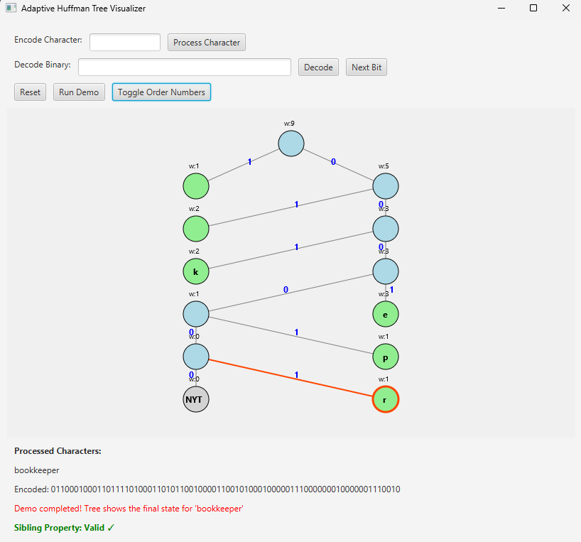

# 🌳 Adaptive Huffman Coding

[](https://www.oracle.com/java/technologies/javase/javase-jdk8-downloads.html)

A robust implementation of the Adaptive Huffman coding algorithm (also known as FGK algorithm) in Java with an interactive visualization component.

## Table of Contents
- [Introduction](#introduction)
- [Algorithm Overview](#algorithm-overview)
- [Features](#features)
- [Implementation Details](#implementation-details)
- [Usage](#usage)
    - [Basic Usage](#basic-usage)
    - [File Processing](#file-processing)
    - [Visualization](#visualization)
- [Test Cases & Performance](#test-cases--performance)
- [Challenges & Solutions](#challenges--solutions)
- [Contributing](#contributing)
- [References](#references)
- [Development Environment](#development-environment)

## 📝 Introduction

Adaptive Huffman coding is a variant of Huffman coding that builds the encoding tree dynamically as data is processed, allowing for single-pass compression without requiring a preliminary analysis of the entire dataset. This implementation follows the FGK (Faller-Gallager-Knuth) algorithm, which maintains a binary tree that satisfies the "sibling property" - ensuring optimal compression as each symbol is processed.

Unlike standard Huffman coding that requires two passes (one to compute frequencies, one to encode), the adaptive approach updates the tree on-the-fly. This makes it suitable for streaming applications, memory-constrained environments, and scenarios where the entire dataset is not available upfront.

## 🔍 Algorithm Overview

### Theory

Adaptive Huffman coding is based on several key principles:

#### 1. NYT (Not Yet Transmitted) Node
- Each time a new symbol is encountered, it's encoded using the NYT node
- The NYT node always represents symbols not yet seen in the input
- The NYT node is initially the only node in the tree

#### 2. Sibling Property
- Nodes can be ordered by increasing weight when traversed from left to right, bottom to top
- Nodes with the same weight should be ordered by their creation time (older nodes have higher order)
- This property ensures the tree maintains optimal compression at each step

#### 3. Dynamic Tree Updates
- Each time a symbol appears, its weight is incremented
- Node swapping may occur to maintain the sibling property
- The tree structure evolves as symbols are processed

### Encoding Process

1. Start with a tree containing only the NYT node
2. For each character in the input:
     - If already seen, output its current code and update its weight
     - If new, output NYT code followed by the character's ASCII representation
3. After each character, update the tree to maintain the sibling property

### Decoding Process

1. Start with the same initial tree as the encoder
2. Follow the encoded bits down the tree until reaching a leaf node
3. If the leaf is NYT, read the next 8 bits as an ASCII character
4. If the leaf is a symbol node, output that symbol
5. Update the tree exactly as the encoder did
6. Continue until all bits are processed

**Important Note:** While the algorithm description suggests using the "same tree," proper implementation requires separate tree instances for encoding and decoding that evolve independently but identically through the same input sequence. This ensures proper adaptive behavior on both ends.

## ✨ Features

- **Complete FGK Implementation**: Full implementation of the Adaptive Huffman algorithm
- **Robustness Enhancements**: Cycle detection, tree validation, and auto-recovery mechanisms
- **Performance Optimizations**: Path caching, simplified mode for complex inputs
- **Interactive Visualization**: Real-time tree evolution visualization with JavaFX
- **Multiple Input Modes**: Process strings, files, or run demos
- **Improved Character Handling**: Special support for Unicode characters and full 16-bit encoding
- **Separate Tree Instances**: Proper implementation using independent trees for encoding and decoding
- **Comprehensive Testing**: Test cases for various input patterns, edge cases and special characters

## 🛠️ Implementation Details

### Core Components

#### Node.java
Represents a node in the Huffman tree with:
- Character data (symbol)
- Weight (frequency count)
- Parent and child references
- Order number (for sibling property)
- Type identification methods (isLeaf(), isNYT())

```java
public class Node {
        char symbol;                    // Character this node represents
        int weight;                     // Frequency counter
        Node left, right, parent;       // Tree connections
        int order;                      // Node order (for sibling property)
        
        // Methods to check node type
        public boolean isLeaf() { return (left == null && right == null); }
        public boolean isNYT() { return isLeaf() && weight == 0; }
}
```

#### HuffmanTree.java
The central class that:
- Manages the adaptive tree structure
- Handles insertion of new symbols
- Updates weights and maintains sibling property through node swapping
- Provides path lookup for encoding/decoding

Key methods:
```java
public void insertNewSymbol(char c) {
        // Adds a new character to the tree:
        // 1. Create internal node to replace current NYT
        // 2. Create new NYT node and character node as children
        // 3. Update tree structure and weights
}

void updateTree(Node node) {
        // Updates weights from node to root
        // Maintains sibling property through swapping
}

void swapIfNeeded(Node node) {
        // Finds and swaps with highest-order node of same weight if needed
        // Critical for maintaining the sibling property
}

String getPath(Node node) {
        // Returns binary path from root to node (0=left, 1=right)
        // Uses caching for performance
}
```

#### Encoder.java
Handles the encoding process:
- Takes input text and produces binary representation
- Manages the encoding logic (existing vs. new symbols)
- Updates the tree after each symbol

```java
public String encode(String text) {
        StringBuilder encoded = new StringBuilder();
        
        for (char c : text.toCharArray()) {
                if (tree.contains(c)) {
                        // Existing character: output its current code, update frequency
                        encoded.append(tree.getCode(c));
                        tree.updateExistingSymbol(c);
                } else {
                        // New character: output NYT code + ASCII, add to tree
                        encoded.append(tree.getNYTCode());
                        encoded.append(toAscii(c));
                        tree.insertNewSymbol(c);
                }
        }
        return encoded.toString();
}
```

#### Decoder.java
Handles the decoding process:
- Takes binary input and produces original text
- Traverses the tree bit-by-bit
- Updates the tree identically to the encoder

```java
public String decode(String bits) {
        StringBuilder decoded = new StringBuilder();
        Node current = tree.root;
        int i = 0;

        while (i <= bits.length()) {
                if (current.isLeaf()) {
                        if (current == tree.NYT) {
                                // NYT node: read ASCII bits for new character
                                String asciiBits = bits.substring(i, i + 8);
                                char c = (char)Integer.parseInt(asciiBits, 2);
                                decoded.append(c);
                                tree.insertNewSymbol(c);
                                i += 8;
                        } else {
                                // Character node: output its symbol
                                decoded.append(current.symbol);
                                tree.updateExistingSymbol(current.symbol);
                        }
                        current = tree.root;  // Reset to root for next character
                } else {
                        // Navigate based on current bit
                        if (bits.charAt(i) == '0') current = current.left;
                        else current = current.right;
                        i++;
                }
        }
        return decoded.toString();
}
```

### Robustness Features

To handle complex inputs and edge cases, the implementation includes:

1. **Cycle Detection** 🔄
     - Checks before node swapping to prevent tree corruption
     - Ensures no ancestor-descendant relationships are swapped
     
2. **Depth Limiting**
     - Prevents excessive recursion during tree updates
     - Configurable maximum update depth
     
3. **Simplified Mode**
     - Alternative processing for complex inputs
     - Disables expensive tree operations when needed
     
4. **Tree Validation** ✅
     - Verifies tree structure integrity after operations
     - Checks for cycles and broken parent-child links
     
5. **Auto-Recovery** 🔄
     - Rebuilds the tree if corruption is detected
     - Preserves character weights during reconstruction

6. **Separate Trees for Encoding/Decoding** 🌲🌲
     - Independent tree instances used for encoding and decoding
     - Both trees evolve identically but separately through the same sequences
     - Essential for proper adaptive coding behavior

7. **Unicode Character Support** 🌐
     - Direct 16-bit encoding for non-ASCII characters
     - Special handling for extended Unicode code points
     - Preserves fidelity with international character sets  

### Visualization Component

The JavaFX-based visualization shows:
- Real-time tree evolution as characters are processed
- Color-coded nodes (NYT, leaf, internal)
- Weight and order numbers
- Highlighted paths during encoding/decoding
- Sibling property validation indicators

## 💻 Usage

### Basic Usage

#### Compilation

```bash
# Create bin directory
mkdir -p bin

# Compile all source files
javac -d bin src/adaptivehuffman/*.java
```

#### Running Demo Mode

```bash
java -cp bin adaptivehuffman.AdaptiveHuffman
```

This demonstrates the algorithm with several examples:
- "ABABABC" (alternating pattern)
- "AAAAAAAA" (repetitive content)
- "ABCDEFGH" (unique characters)
- Additional examples with stress tests

#### Custom Text Input

```bash
java -cp bin adaptivehuffman.AdaptiveHuffman "YourTextHere"
```

Example:
```bash
java -cp bin adaptivehuffman.AdaptiveHuffman "Hello World"
```

Output:
```
Original text: Hello World
Original size (bits): 88
Encoded bits: 010010000011001010001101100001000011011110000001000000000001010111000100000001110010001000000001100100
Encoded size (bits): 102
Compression ratio: -15.91%
Decoded text: Hello World
Verification: SUCCESS ✓
```

### File Processing

#### Encoding a File

```bash
java -cp bin adaptivehuffman.FileProcessor encode input.txt encoded.bin
```

#### Decoding a File

```bash
java -cp bin adaptivehuffman.FileProcessor decode encoded.bin output.txt
```

#### Advanced Options

For optimal handling of very large files:

```bash
# Use larger heap size for large files
java -Xmx512m -cp bin adaptivehuffman.FileProcessor encode large_input.txt encoded.bin
```

### Visualization

Start the interactive tree visualization:

```bash
java -cp bin adaptivehuffman.HuffmanTreeVisualizer
```

Features:
- **Process Character**: Enter a single character to see its encoding and tree update
- **Run Demo**: Watch the tree evolve through the "bookkeeper" example
- **Decode Binary**: Enter a binary string to visualize decoding step-by-step
- **Next Bit**: Step through decoding bit-by-bit
- **Toggle Order Numbers**: Show/hide node ordering information
- **Reset**: Clear the tree and start over



## 📊 Test Cases & Performance

### Test Case Results

#### Test Case 1: Repetitive Content

```
Original text: AAAAAAAA
Original size (bits): 64
Encoded bits: 010000011111111
Encoded size (bits): 15
Compression ratio: 76.56%
Decoded text: AAAAAAAA
Verification: SUCCESS ✓
```

Analysis: Excellent compression (76.56%) with repetitive content. The first 'A' requires 9 bits (NYT + ASCII), but subsequent 'A's need only 1 bit each.

#### Test Case 2: Mixed Content with Repeats

```
Original text: ABABABC
Original size (bits): 56
Encoded bits: 010000010010000101010110001000011
Encoded size (bits): 33
Compression ratio: 41.07%
Decoded text: ABABABC
Verification: SUCCESS ✓
```

Analysis: Good compression (41.07%) with alternating pattern. New characters require full encoding, but repeats benefit from shorter codes.

#### Test Case 3: No Repetition

```
Original text: ABCDEFGH
Original size (bits): 64
Encoded bits: 01000001001000010000100001100001000100000001000101000000100011000000001000111000000001001000
Encoded size (bits): 92
Compression ratio: -43.75%
Decoded text: ABCDEFGH
Verification: SUCCESS ✓
```

Analysis: Negative compression (-43.75%) with unique characters. Each new symbol requires NYT + ASCII encoding, resulting in expansion.

#### Test Case 4: MISSISSIPPI

```
Original text: MISSISSIPPI
Original size (bits): 88
Encoded bits: 010011010010010010001010011001010010010100001010000000101
Encoded size (bits): 57
Compression ratio: 35.23%
Decoded text: MISSISSIPPI
Verification: SUCCESS ✓
```

Analysis: Good compression (35.23%) with repeated patterns.

#### Test Case 5: Special Characters

```
Input: €¥₹♠♣★↑↓←→
Original size (bits): 80
Encoded size (bits): 160
Match?: true
```

Analysis: For special Unicode characters, a direct 16-bit encoding approach is used rather than adaptive Huffman. This ensures compatibility with characters outside the ASCII range at the cost of compression efficiency.

### Performance Analysis

- **Best Case** 🚀: Highly repetitive content (~70-80% compression)
- **Average Case** ⚡: Mixed content with repeats (~30-60% compression)
- **Worst Case** ⚠️: No repetition (slight expansion due to overhead)
- **Special Cases**: Unicode characters use direct 16-bit encoding

## 🔧 Challenges & Solutions

### Challenge 1: Tree Swapping Complexities

**Problem:** The node swapping mechanism to maintain the sibling property was complex and prone to errors, including infinite loops and tree corruption.

**Solution:**
- Implemented careful reference management during swaps
- Added pre-swap validation with cycle detection
- Created a tree integrity checker to detect issues
- Added auto-recovery mechanism to rebuild corrupted trees

### Challenge 2: Performance with Complex Inputs

**Problem:** Large or complex inputs could cause performance bottlenecks or stack overflows due to deep recursion.

**Solution:**
- Added path caching to avoid recalculating tree paths
- Implemented simplified mode that limits expensive operations
- Replaced recursive operations with iterative versions for critical paths
- Added configurable depth limits for recursive operations

### Challenge 3: Debugging Tree State

**Problem:** Difficult to visualize and understand tree evolution, especially during node swapping.

**Solution:**
- Created comprehensive visualization component
- Added real-time tree rendering with node details
- Implemented step-by-step encoding/decoding visualization
- Added debug output for sibling property validation

### Challenge 4: Separate Trees for Encoding/Decoding

**Problem:** Initially the same tree instance was shared between encoder and decoder, causing incorrect decoding because the tree state was already modified by encoding.

**Solution:**
- Implemented separate tree instances for encoding and decoding
- Ensured both trees evolve through identical steps independently
- Added test cases to verify correct encoder-decoder separation
- Validated with various input types including special characters

## 👥 Contributing

Contributions are welcome! Please feel free to submit a Pull Request.

1. Fork the repository
2. Create your feature branch (`git checkout -b feature/amazing-feature`)
3. Commit your changes (`git commit -m 'Add some amazing feature'`)
4. Push to the branch (`git push origin feature/amazing-feature`)
5. Open a Pull Request

## 📚 References

- Vitter, J. S. (1987). "Design and Analysis of Dynamic Huffman Codes." *Journal of the ACM*, 34(4), 825–845.
- Gallager, R. G. (1978). "Variations on a Theme by Huffman." *IEEE Transactions on Information Theory*, 24(6), 668-674.
- Knuth, D. E. (1985). "Dynamic Huffman Coding." *Journal of Algorithms*, 6(2), 163-180.
- [Ben Tanen's Interactive Adaptive Huffman Visualization](https://ben-tanen.com/adaptive-huffman/)
- [GeeksForGeeks: Adaptive Huffman Coding and Decoding](https://www.geeksforgeeks.org/adaptive-huffman-coding-and-decoding/)

## 🖥️ Development Environment

### Required Software Versions
- **Java**: Java version "21.0.2" 2024-01-16 LTS
- **JavaFX**: JavaFX SDK 21.0.6
- **Build System**: No external build system required, uses standard Java compiler

### Dependencies
This implementation is designed to have minimal dependencies:
- Core algorithm: Standard Java libraries only
- Visualization: JavaFX SDK 21.0.6 (must be separately installed)

### Setup Instructions
1. Download and install Java 21.0.2 LTS from the [Oracle website](https://www.oracle.com/java/technologies/javase/jdk21-archive-downloads.html)
2. Download JavaFX SDK 21.0.6 from [JavaFX website](https://gluonhq.com/products/javafx/)
3. Extract the JavaFX SDK to a directory of your choice
4. Add the JavaFX libraries to your module path when running the visualization component:

```bash
# For running the visualization component
java --module-path /path/to/javafx-sdk-21.0.6/lib --add-modules javafx.controls,javafx.fxml -cp bin adaptivehuffman.HuffmanTreeVisualizer
```

### Setup Verification
To verify your environment is properly set up:

```bash
# Check Java version
java -version
# Should output: java version "21.0.2" 2024-01-16 LTS

# Test JavaFX setup
java --module-path /path/to/javafx-sdk-21.0.6/lib --add-modules javafx.controls -cp bin adaptivehuffman.TestJavaFXSetup
```
